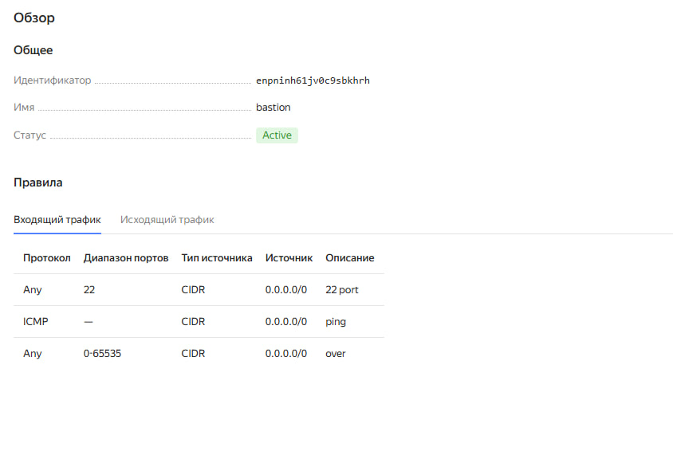
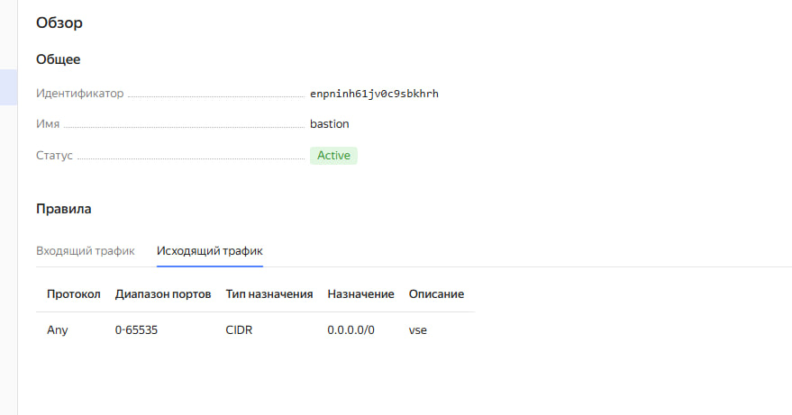

# diplom_pronin

### Создаем Bastion host
- Провалиемся "Все сервисы -> Compute Cloud -> Виртуальные машины -> Создать"
- В открывшемся окне выбираем следующее:
    - Образ: Ubuntu 24.04
    - Расположение: любое
    - Диски и файловые хранилища: HDD - 20 GB
    - Вычислительные ресурсы: своя конфигурация
        - Платформа: Intel Ice Lake
        - vCPU: 2
        - Гарантированная доля vCPU: 50%
        - Прерываемая: нет
    - Сетевой интерфейс №0
        - Подсеть: не меняем
        - Публичный адрес: автоматичеси
        - Группы безопасности:
            - Имя: любое читаемое 
            - Описание: Доступ из-вне только по ssh
    - Доступ:
        - Логин: любой
        - SSH-ключ: вставляем свой публичный
    - Общая информация:
        - Имя: bastion
        - Описание: любое
- Создать ВМ
- Ждем создания и проваливаемся в "Virtual Private Cloud -> Группы безопасности"
- Редактировать
- Создаем правило для входящего трафика по аналогии со скриншотом (ICMP и any на все порты потом удалим, надо временно для установки пакетов)
- Создаем правило полного доступа на исходящий трафик по аналогии со скриншотом

