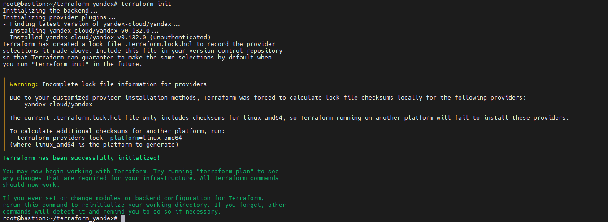
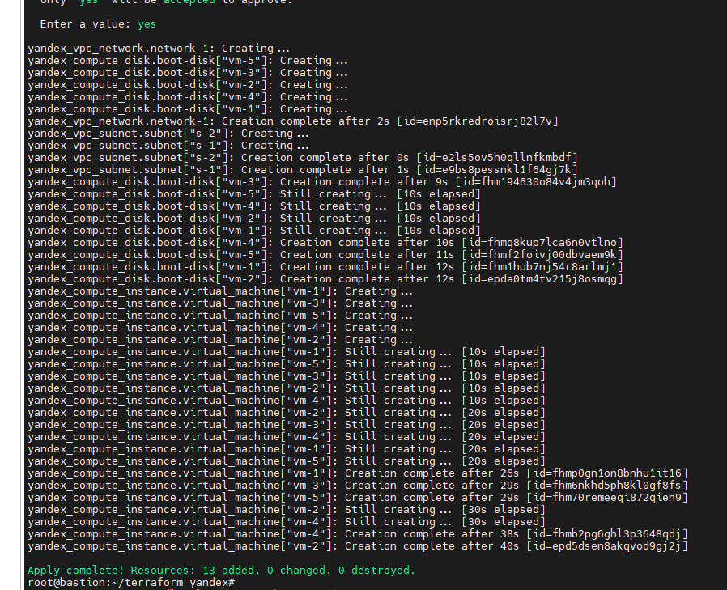
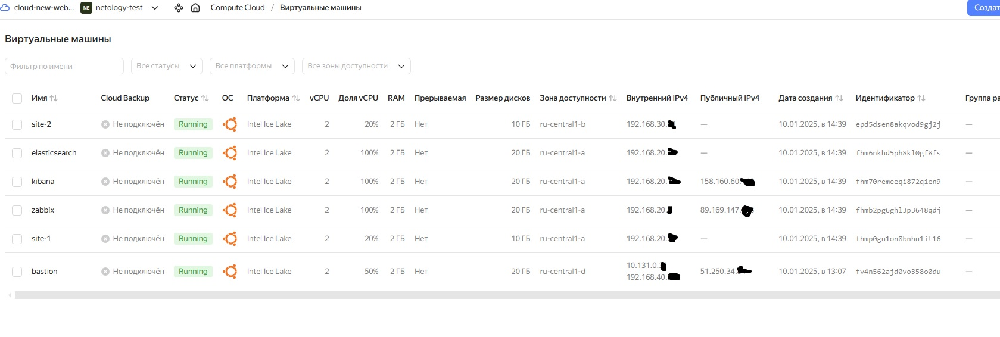
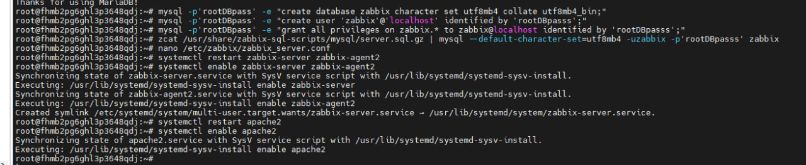
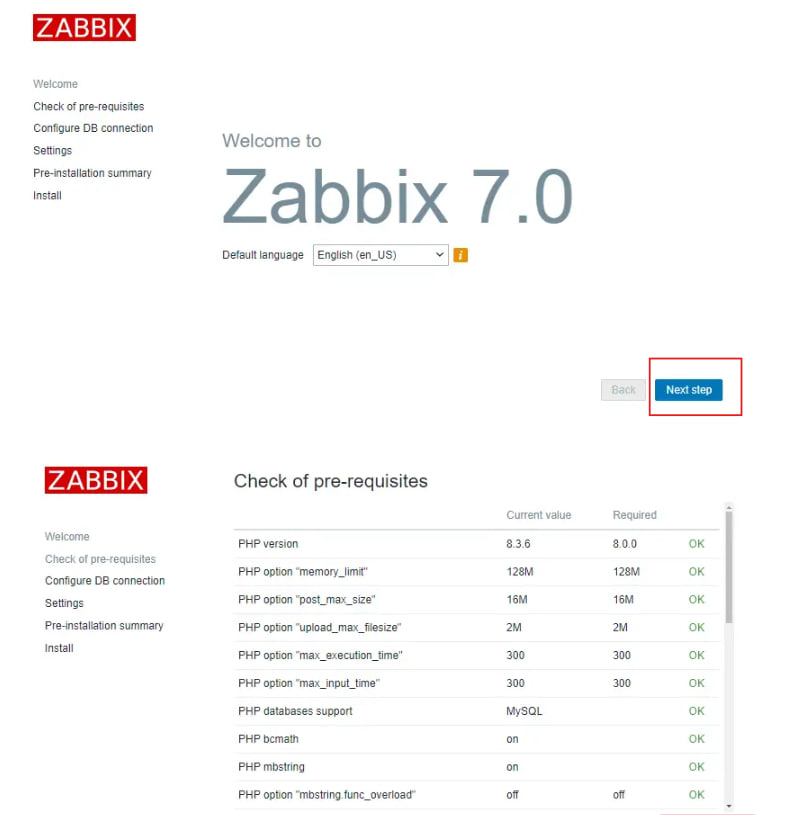
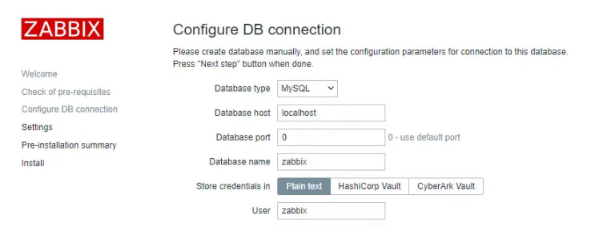

# diplom_pronin

### Создаем Bastion host
- Провалиемся "Все сервисы -> Compute Cloud -> Виртуальные машины -> Создать"
- В открывшемся окне выбираем следующее:
    - Образ: Ubuntu 24.04
    - Расположение: любое
    - Диски и файловые хранилища: HDD - 20 GB
    - Вычислительные ресурсы: своя конфигурация
        - Платформа: Intel Ice Lake
        - vCPU: 2
        - Гарантированная доля vCPU: 50%
        - Прерываемая: нет
    - Сетевой интерфейс №0
        - Подсеть: не меняем
        - Публичный адрес: автоматичеси
        - Группы безопасности:
            - Имя: любое читаемое 
            - Описание: Доступ из-вне только по ssh
    - Доступ:
        - Логин: любой
        - SSH-ключ: вставляем свой публичный
    - Общая информация:
        - Имя: bastion
        - Описание: любое
- Создать ВМ
- Ждем создания и проваливаемся в "Virtual Private Cloud -> Группы безопасности"
- Редактировать
- Создаем правило для входящего трафика по аналогии со скриншотом (ICMP и any на все порты потом удалим, надо временно для установки пакетов)
- Создаем правило полного доступа на исходящий трафик по аналогии со скриншотом


### Настройка Bastion/Jump host
Все дальнейшие шаги делаем от рута

Ставим пакеты:
```
apt install wget curl unzip -y
```
Ставим Terrafrom версии 1.9.8
```
wget https://hashicorp-releases.yandexcloud.net/terraform/1.9.8/terraform_1.9.8_linux_amd64.zip && unzip terraform_1.9.8_linux_amd64.zip -d /usr/bin
```
Проверка работы терраформа terraform --version , если все ок, должен отдать версию терраформа.

Установка утилит яндекса
```
curl -sSL https://storage.yandexcloud.net/yandexcloud-yc/install.sh | bash 
cp yandex-cloud/bin/* /usr/bin/
```
Инициализация - yc init , команда выдаст нам ссылку , которую нужно вставить в браузере и получить токен для дальнейшей работы.
Стандартные значения, отвечаем на все вопросы в консоли и успешно выполняем инициализацию.


Далее потребутся создать сервисный аккаунт.
в https://console.yandex.cloud/ и выполняем:

- Сверху выбераем раздел «Сервисные аккаунты»
- Создаем новый аккаунт с любым именем и ролью admin. Для этого кликаем на троеточие в правом верхнем углу → «Создать сервисный аккаунт»
- Нажимаем на созданную учётную запись
- Копируем ID себе

Подключаемся к машине bastion.
требуется скорректировать через nano ~/.terraformrc ,  вписываем:
```
provider_installation {
  network_mirror {
    url = "https://terraform-mirror.yandexcloud.net/"include = ["registry.terraform.io/*/*"]
  }
  direct {
    exclude = ["registry.terraform.io/*/*"]
  }
}
```

Делается это для того, чтобы провайдер бралились из https://terraform-mirror.yandexcloud.net/ , чтобы тераформ не пытался скачивать провайдеры из своего репозитория.

Создаем ключ авторизации для провайдера:
```
yc iam key create \
  --service-account-id <id сервисного аккаунта, который копировали себе> \
  --folder-name default \
  --output key.json 
```

Требуется еще войти в https://console.yandex.cloud/ забрать нужные нам данные для авторизации в консоле:

- имя облака — оно начинается с cloud-. Рядом с ним появится ID, который нужно скопировать себе.
- имя каталога под названием облака — сохраняем себе ID.


Идем в консоль нашей машины bastion
По очереди выполняем команды и записываем их себе, потому что при перезагрузке ВМ настройки слетят и придется выполнять их по-новой:
```
yc config profile create <любое имя профиля> - создается один раз
yc config set service-account-key key.json - ключ которы генерился после инициализации
yc config set cloud-id <ID облака> 
yc config set folder-id <ID каталога>
    
export YC_TOKEN=$(yc iam create-token) 
export YC_CLOUD_ID=$(yc config get cloud-id)
export YC_FOLDER_ID=$(yc config get folder-id) 
```

Настраиваем провайдер. Для этого создадим новый каталог с любым именем и перейдем в него, после чего создаем файл providers.tf
```
mkdir ~/terraform_yandex && cd ~/terraform_yandex && touch providers.tf
```
В созданном файле добавляем содержимое
```
terraform {
  required_providers {
    yandex = {
      source = "yandex-cloud/yandex"
    }
  }
  required_version = ">= 0.13"
}

provider "yandex" {
  zone = "ru-central1-b"
}
```
Для проверки, что нет ошибки выполним команду terraform init



### Описание структуры
1. providers.tf - настройка провайдера, уже выполнено
2. variables.tf - тут хранятся только дефолтные значения, которые можно переписать в других файлах
3. terraform.tfvars - файлы с переменными. Они используются для перезаписи из variables.tf
4. output.tf - в нем описывается что должно отобразиться в консоли после выполнения действий
5. main.tf - что будет делать терраформ

variables.tf
```
variable "virtual_machines" {
 default = ""
}

variable "subnets" {
 default = ""
}
```

Всю структуру описываем в *.tfvars. Для этого создадим файл vms.tfvars с содержимым:
```
subnets = {
  "s-1" = {
    name = "sub-1"
    zone = "ru-central1-a"
    v4_cidr_blocks = ["192.168.20.0/24"]
  },
  "s-2" = {
    name = "sub-2"
    zone = "ru-central1-b"
    v4_cidr_blocks = ["192.168.30.0/24"]
  },
  "s-3" = {
    name = "sub-3"
    zone = "ru-central1-b"
    v4_cidr_blocks = ["192.168.40.0/24"]
  }
}

virtual_machines = {
    "vm-1" = {
      vm_name       = "site-1" # Имя ВМ
      vm_desc       = "Описание для нас. Его видно только здесь" # Описание
      vm_cpu        = 2 # Кол-во ядер процессора
      ram           = 2 # Оперативная память в ГБ
      disk          = 10 # Объем диска в ГБ
      disk_name     = "site-1-disk" # Название диска
      template      = "fd85bll745cg76f707mq" # ID образа ОС для использования
      public_ip     = false
      managed       = true
      zone          = "ru-central1-a"
      disk_type     = "network-hdd"
      core_fraction = 20
      platform_id   = "standard-v3"
      subnet        = "s-1"
    },
    "vm-2" = {
      vm_name      = "site-2" # Имя ВМ
      vm_desc      = "Описание для инженеров. Его видно только здесь"
      vm_cpu       = 2 # Кол-во ядер процессора
      ram          = 2 # Оперативная память в ГБ
      disk         = 10 # Объем диска в ГБ
      disk_name    = "site-2-disk" # Название диска
      template     = "fd85bll745cg76f707mq" # ID образа ОС для использования
      public_ip    = false
      managed      = true
      zone         = "ru-central1-b"
      disk_type    = "network-hdd"
      core_fraction = 20
      platform_id   = "standard-v3"
      subnet        = "s-2"
    },
    "vm-3" = {
      vm_name      = "elasticsearch" # Имя ВМ
      vm_desc      = "Описание для инженеров. Его видно только здесь"
      vm_cpu       = 2 # Кол-во ядер процессора
      ram          = 2 # Оперативная память в ГБ
      disk         = 20 # Объем диска в ГБ
      disk_name    = "elasticsearch4-disk" # Название диска
      template     = "fd85bll745cg76f707mq" # ID образа ОС для использования
      public_ip    = false
      managed      = true
      zone         = "ru-central1-a"
      disk_type    = "network-hdd"
      core_fraction = 100
      platform_id   = "standard-v3"
      subnet        = "s-1"
    },
    "vm-4" = {
      vm_name      = "zabbix" # Имя ВМ
      vm_desc      = "Описание для инженеров. Его видно только здесь"
      vm_cpu       = 2 # Кол-во ядер процессора
      ram          = 2 # Оперативная память в ГБ
      disk         = 20 # Объем диска в ГБ
      disk_name    = "zabbix-disk" # Название диска
      template     = "fd85bll745cg76f707mq" # ID образа ОС для использования
      public_ip    = true
      managed      = true
      zone         = "ru-central1-a"
      disk_type    = "network-hdd"
      core_fraction = 100
      platform_id   = "standard-v3"
      subnet        = "s-1"
    },
    "vm-5" = {
      vm_name      = "kibana" # Имя ВМ
      vm_desc      = "Описание для инженеров. Его видно только здесь"
      vm_cpu       = 2 # Кол-во ядер процессора
      ram          = 2 # Оперативная память в ГБ
      disk         = 20 # Объем диска в ГБ
      disk_name    = "kibana-disk" # Название диска
      template     = "fd85bll745cg76f707mq" # ID образа ОС для использования
      public_ip    = true
      managed      = true
      zone         = "ru-central1-a"
      disk_type    = "network-hdd"
      core_fraction = 100
      platform_id   = "standard-v3"
      subnet        = "s-1"
    }
}
```
Надо создать ключ пару
```
ssh-keygen -t ed25519
```
Ключи будут вот тут -->> ~/.ssh/id_ed25519.pub и тут же приватник

Создаем файл main.tf с содержимым:
```
resource "yandex_compute_disk" "boot-disk" {
  for_each = var.virtual_machines
  name     = each.value["disk_name"]
  type     = each.value["disk_type"]
  zone     = each.value["zone"]
  size     = each.value["disk"]
  image_id = each.value["template"]
}

resource "yandex_vpc_network" "network-1" {
  name = "network-1"
}

resource "yandex_vpc_subnet" "subnet" {
  for_each       = var.subnets
  name           = each.value["name"]
  zone           = each.value["zone"]
  network_id     = yandex_vpc_network.network-1.id
  v4_cidr_blocks = each.value["v4_cidr_blocks"]
}

resource "yandex_compute_instance" "virtual_machine" {
  for_each        = var.virtual_machines
  name = each.value["vm_name"]
  zone = each.value["zone"]
  allow_stopping_for_update = true

  platform_id = each.value["platform_id"]
  resources {
    cores  = each.value["vm_cpu"]
    memory = each.value["ram"]
    core_fraction = each.value["core_fraction"]
  }

  boot_disk {
    disk_id = yandex_compute_disk.boot-disk[each.key].id
  }

  network_interface {
    subnet_id = yandex_vpc_subnet.subnet[each.value.subnet].id
    nat       = each.value["public_ip"]
  }

  metadata = {
    ssh-keys = "dmitriy_pronin:${file("~/.ssh/id_ed25519.pub")}"
  }
}
```

Далее запускаем terraform apply и ждем как все прокатиться.


PS: на моменте создания виртуалок может возникнуть ошибка связанная с квотой. Для ее устранения придется делать заявку на повышения квоты на сети. делают быстро.

Заходим на бастион в клауде, выключаем и добавляем ему сетевой интерфейс в одной из созданных сетей. После чего добавляем в системе в таблицу маршрутизации маршруты
```
ip route add 192.168.30.0/24 via 192.168.40.1
ip route add 192.168.20.0/24 via 192.168.40.1
```
Далее идем настраивать балансеры.
в main.tf дописываем
```
resource "yandex_lb_target_group" "nlb-group" {
  name      = "nlb-group-1"
  region_id = "ru-central1"

  target {
    subnet_id = yandex_vpc_subnet.subnet["s-1"].id
    address   = yandex_compute_instance.virtual_machine["vm-1"].network_interface.0.ip_address
  }

  target {
    subnet_id = yandex_vpc_subnet.subnet["s-2"].id
    address   = yandex_compute_instance.virtual_machine["vm-2"].network_interface.0.ip_address
  }
}

resource "yandex_lb_network_load_balancer" "nlb" {
  name = "nlb"

  listener {
    name = "http"
    port = 80
    external_address_spec {
      ip_version = "ipv4"
    }
  }

  attached_target_group {
    target_group_id = yandex_lb_target_group.nlb-group.id

    healthcheck {
      name = "http"
      http_options {
        port = 80
        path = "/"
      }
    }
  }
}
```
Далее ставим ansible на машину bastion - apt install ansible.

## Работаем с ансибл
Создадим каталог для сохранения файлов ансибла и файлики 
mkdir ~/ansible && cd ~/ansible && touch inventory.yml && touch playbook.yml && touch ansible.cfg
Кусочек из работы:
inventory.yml
```
linux: #группа хостов
  children: #Делал для подгруппы хостов
    nginx:
      hosts:
        site-1:
          ansible_host: брал_с_клауда.auto.internal 
        site-2:
          ansible_host: epd4ua449pd1lkaa2vhm.auto.internal #Адрес машиныw
  vars: #Переменные подрупп
    ansible_user: "юзер_из_мейна_терраформа"
    connection_protocol: ssh
    ansible_become: true #переход в рута
    ansible_ssh_private_key_file: ~/.ssh/id_ed25519
```

playbook.yml
```
- name: Установка стандартных пакетов
  hosts: all
  roles:
    - role: default_packages
  tags:
    - install_packages
    
- name: Установка и настройка nginx c кастомной страницей
  hosts: nginx
  roles:
    - role: nginx_custom
  tags:
    - nginx_custom
```
ansible.cfg
```
[defaults]
host_key_checking = false
```
Создание ролей
```
ansible-galaxy init default_packages
ansible-galaxy init nginx_custom
```
Идем и корректируем
nano default_packages/tasks/main.yml

```
- name: Название машины
  shell: "echo {{ inventory_hostname }} > /etc/hostname"
  when: "inventory_hostname != ansible_hostname"

- name: Установка программ #Имя задачи
  apt: #Используемый модуль
    name: "{{ item }}" 
    state: present
  loop:
    - "{{ packages_to_install }}" #Цикл будет перебирать все значения из переме>
```
nano default_packages/vars/main.yml
```
packages_to_install:
  - dnsutils
  - net-tools
  - rsync
  - mc
  - curl
  - wget
  - apt-transport-https
  - gnupg2
  - software-properties-common
  - ca-certificates
  - parted
```
Для кастом нжинкс nano nginx_custom/tasks/main.yml
```
- name: Установка Nginx
  apt:
    name: "nginx"
    state: present

- name: Подмена веб-страницы
  ansible.builtin.template:
    src: index.j2
    dest: /var/www/html/index.nginx-debian.html
  notify: "Nginx Reloader"
```
nano nginx_custom/handlers/main.yml
```
# handlers file for nginx_custom
- name: Nginx Reloader
  ansible.builtin.service:
    name: nginx
    state: restarted
    enabled: yes
  listen: "Nginx Reloader"
```
nano nginx_custom/templates/main.yml
```
<body>
<p><center><b>Hello from {{ inventory_hostname }}!</b></center></p>
</body>
```
Прокатил роль ансибла ansible-playbook -i inventory.yaml playbook.yaml


Тут достаточно емко описывать каждый шаг как он выглядит, целесообразней поглядеть как в приложенных файлах под ансибл.
Сделал раскатку сразу всех компонентов, чтобы не тратить поодиночке на запуск ролей с плейбуками.
Скажу так, что долго мучался с с поиском репозиториев с зеркалами яндекса.

Для терраформа добавил настройку.
в main.tf
```
resource "yandex_vpc_gateway" "private_net" {
  name = "private_net_nat"
  shared_egress_gateway {}
}

resource "yandex_vpc_route_table" "route_with_nat" {
  network_id = "${yandex_vpc_network.network-1.id}" 

  static_route {
    destination_prefix = "192.168.30.0/24"
    next_hop_address   = "192.168.30.1"
  }

  static_route {
    destination_prefix = "192.168.20.0/24"
    next_hop_address   = "192.168.30.1"
  }

  static_route {
    destination_prefix = "0.0.0.0/0"
    gateway_id         = "${yandex_vpc_gateway.private_net.id}"
  }
}

#Этот ресурс у нас уже есть, добавляем строу
resource "yandex_vpc_subnet" "subnet" {
  for_each       = var.subnets
  name           = each.value["name"]
  zone           = each.value["zone"]
  network_id     = yandex_vpc_network.network-1.id
  v4_cidr_blocks = each.value["v4_cidr_blocks"]
  route_table_id = yandex_vpc_route_table.route_with_nat.id
}
```
#network-1 - это индекс с которым мы создали сеть
route_table_id = yandex_vpc_route_table.route_with_nat.id - связка подсетки с маршрутизацией

Для снепшотов в тот же мейн добавляем
```
resource "yandex_compute_snapshot" "disk-snap" {
  for_each = var.virtual_machines
  name     = each.value["disk_name"]
  source_disk_id = yandex_compute_disk.boot-disk[each.key].id
}

resource "yandex_compute_snapshot_schedule" "one_week_ttl_every_day" {
  for_each = var.virtual_machines
  name     = each.value["disk_name"]

  schedule_policy {
        expression = "0 0 * * *"
  }

  snapshot_count = 7
  retention_period = "168h" 

  disk_ids = ["${yandex_compute_disk.boot-disk[each.key].id}"] #Расписание применяется к ранее созданным дискам
}
```
- expression = "0 0 * * *" - ежедневно в 00
- snapshot_count = 7 - 7 снепшотов которые живут
- retention_period = "168h" - срок жизни неделя


Настройка кибаны на http://<публичный адрес kibana>:5601

Принимаем соглашения, создаем новый Data View

`` name: Любое index-template: filebeat-*
смотрим логи


Тачки у нас получились вот такие после запуска терраформа:


## БД
Заходим по ssh на машину с бд и делаем mysql_secure_installation
Далее настраиваем 
```
root@fhmb2pg6ghl3p3648qdj:~# mysql_secure_installation

NOTE: RUNNING ALL PARTS OF THIS SCRIPT IS RECOMMENDED FOR ALL MariaDB
      SERVERS IN PRODUCTION USE!  PLEASE READ EACH STEP CAREFULLY!

In order to log into MariaDB to secure it, we'll need the current
password for the root user. If you've just installed MariaDB, and
haven't set the root password yet, you should just press enter here.

Enter current password for root (enter for none):
OK, successfully used password, moving on...

Setting the root password or using the unix_socket ensures that nobody
can log into the MariaDB root user without the proper authorisation.

You already have your root account protected, so you can safely answer 'n'.

Switch to unix_socket authentication [Y/n] y
Enabled successfully!
Reloading privilege tables..
 ... Success!


You already have your root account protected, so you can safely answer 'n'.

Change the root password? [Y/n] y
New password:
Re-enter new password:
Password updated successfully!
Reloading privilege tables..
 ... Success!


By default, a MariaDB installation has an anonymous user, allowing anyone
to log into MariaDB without having to have a user account created for
them.  This is intended only for testing, and to make the installation
go a bit smoother.  You should remove them before moving into a
production environment.

Remove anonymous users? [Y/n] y
 ... Success!

Normally, root should only be allowed to connect from 'localhost'.  This
ensures that someone cannot guess at the root password from the network.

Disallow root login remotely? [Y/n] y
 ... Success!

By default, MariaDB comes with a database named 'test' that anyone can
access.  This is also intended only for testing, and should be removed
before moving into a production environment.

Remove test database and access to it? [Y/n] y
 - Dropping test database...
 ... Success!
 - Removing privileges on test database...
 ... Success!

Reloading the privilege tables will ensure that all changes made so far
will take effect immediately.

Reload privilege tables now? [Y/n] y
 ... Success!

Cleaning up...

All done!  If you've completed all of the above steps, your MariaDB
installation should now be secure.

Thanks for using MariaDB!
```
Выполняем ряд команд


Проверим, что в nano /etc/zabbix/zabbix_server.conf DBPassword стал нашим.

В браузере смотрим настройки и дозовершаем процесс, http://<публичный адрес zabbix>/zabbix


Тут важно ввести верные данные и уже коннектиться к бд.


