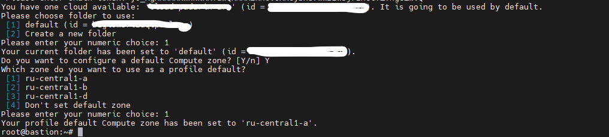

# diplom_pronin

### Создаем Bastion host
- Провалиемся "Все сервисы -> Compute Cloud -> Виртуальные машины -> Создать"
- В открывшемся окне выбираем следующее:
    - Образ: Ubuntu 24.04
    - Расположение: любое
    - Диски и файловые хранилища: HDD - 20 GB
    - Вычислительные ресурсы: своя конфигурация
        - Платформа: Intel Ice Lake
        - vCPU: 2
        - Гарантированная доля vCPU: 50%
        - Прерываемая: нет
    - Сетевой интерфейс №0
        - Подсеть: не меняем
        - Публичный адрес: автоматичеси
        - Группы безопасности:
            - Имя: любое читаемое 
            - Описание: Доступ из-вне только по ssh
    - Доступ:
        - Логин: любой
        - SSH-ключ: вставляем свой публичный
    - Общая информация:
        - Имя: bastion
        - Описание: любое
- Создать ВМ
- Ждем создания и проваливаемся в "Virtual Private Cloud -> Группы безопасности"
- Редактировать
- Создаем правило для входящего трафика по аналогии со скриншотом (ICMP и any на все порты потом удалим, надо временно для установки пакетов)
- Создаем правило полного доступа на исходящий трафик по аналогии со скриншотом


### Настройка Bastion/Jump host
Все дальнейшие шаги делаем от рута

Ставим пакеты:
```
apt install wget curl unzip -y
```
Ставим Terrafrom версии 1.9.8
```
wget https://hashicorp-releases.yandexcloud.net/terraform/1.9.8/terraform_1.9.8_linux_amd64.zip && unzip terraform_1.9.8_linux_amd64.zip -d /usr/bin
```
Проверка работы терраформа terraform --version , если все ок, должен отдать версию терраформа.

Установка утилит яндекса
```
curl -sSL https://storage.yandexcloud.net/yandexcloud-yc/install.sh | bash 
cp yandex-cloud/bin/* /usr/bin/
```
Инициализация - yc init , команда выдаст нам ссылку , которую нужно вставить в браузере и получить токен для дальнейшей работы.
Стандартные значения, отвечаем на все вопросы в консоли и успешно выполняем инициализацию.


Далее потребутся создать сервисный аккаунт.
в https://console.yandex.cloud/ и выполняем:

- Сверху выбераем раздел «Сервисные аккаунты»
- Создаем новый аккаунт с любым именем и ролью admin. Для этого кликаем на троеточие в правом верхнем углу → «Создать сервисный аккаунт»
- Нажимаем на созданную учётную запись
- Копируем ID себе


